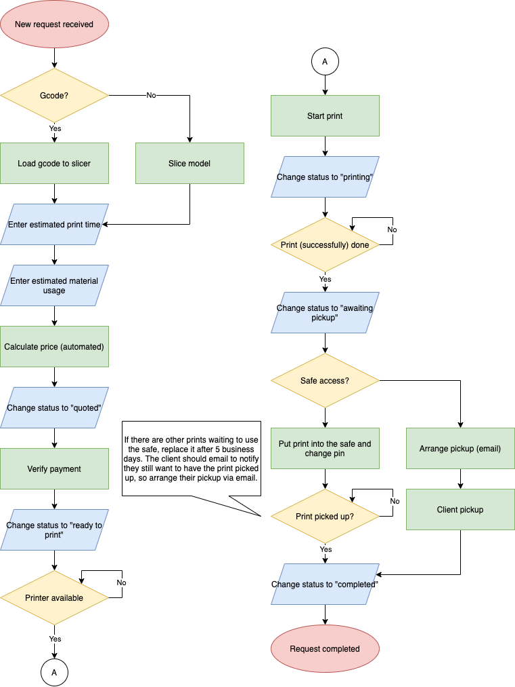
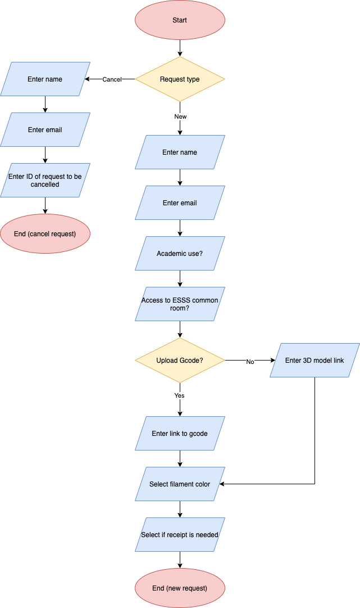
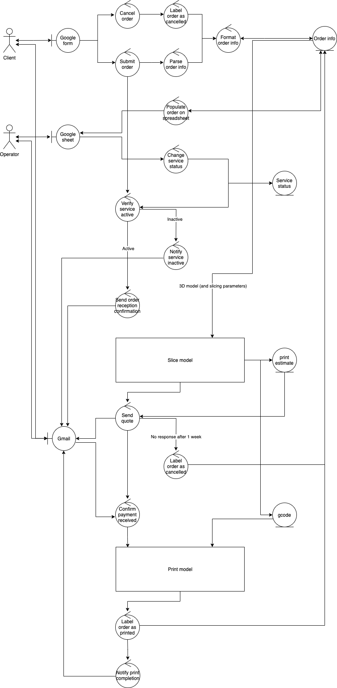

# ESSS 3D Printing Request Management System

This system is what's behind https://www.esss.ca/3d-printing. The director of resource center should at least understand what is explained on this README before using the system. Contact [Aki Zhou](mailto:aki@akizhou.com), the original author of this project, for any questions.

It is highly recommended to go over [Google's Apps Script Guides](https://developers.google.com/apps-script/overview) for an overview of how Apps Script works.

##### *For non-ESSS viewers*
*<small>This project is used by ESSS 3D Printing, so if you are an outsider, you do not have access to some files referenced by IDs in the code. If you wish to use the code for your own operation, please take a look at the `files` directory containing copies of these files. I have also included links to copies of these files on google drive, since some properties of google service files aren't retained once downloaded.</small>*

## Motivation

Managing 3D printing requests is not a simple job. Many processes happen between a client submitting their request and them receiving the print. Although, timewise, the majority of the processes are the actual printing, and that is done by the magical machine of creativity, the 3D printer, managing the rest of work can still be cumbersome.

Utilizing the power of Apps Script and the APIs of Google Workspace services, the part that required manual work is minimized. No more email writing. Yay!!! 

Now, most of the time/resources can be spent on improving the printer or other things.

## Installation

Since this is a stand alone Apps Script project, set up is not straightforward, but don't worry it's easy.

To begin with, the role of every file needs to be explained and well understood.
Aside from the Apps Script project itself, there are 3 things that are necessary for this system. A google form, spreadsheet, and document.

The following is the file structure for this system. For the ESSS director of resource center, these files are on the google drive.

```
3D Printing
|__ Print Request Manager (Apps Script project)
|__ ESSS 3D Print Request (Google Form)
|__ Request Queue (Spreadsheet)
|__ Receipt Template (Document)
|__ Issued Receipts
    |__ "Receipt (ID)"
    .
    .
    .
```
#### Apps Script project
This is a stand alone apps script project and its code is in `apps-script` directory of this repository. The apps script orchestrates all the other files. It detects new requests, cancel requests, and manipulates the spreadsheet accordingly. It also sends emails to notify the client about the progress at each stage and generates a receipt for them if requested.

#### Google From
This is the interface where clients submit new requests or cancel requests.
Each submitted request is automatically recorded on the "Form Responses" sheet in the "Request Queue" spreadsheet. The script will detect these and parse information then enqueue the request to the "Queue" sheet or move the request to "Archive" sheet if cancelled.

#### Spreadsheet
The spreadsheet is the interface for the system operator. It contains four sheets as listed below.
* **Queue**: Main sheet used. Current and ongoing requests are listed here.
* **Archive**: For record keeping purposes. Completed and cancelled requests live here. *(Not recommended to touch any data manually)*
* **Service Status**: Provides metadata about the service. *(Manipulate data when necessary)*
* **Form Responses**: This is automatically filled by Google Form and the script watches this sheet for request submissions. *(Not recommended to touch any data manually)*

#### Document
This is just a template for receipts. Variables replaced by request specific values are surrounded by "!".<br> i.e. `!price!`.
All issued receipts are kept in "Issued Receipts" folder and the filename contains the request ID.

#### Setting up everything
After understanding what file is for what. It is time to understand how they are interconnected.
As described above, the apps script controls almost everything and the clients use google forms and the operator uses spreadsheet. This system is built by first creating a google form with questions and then it is linked to a spreadsheet so when anyone submits a request using the google form, it is recorded on the spreadsheet. The script detects submissions by having event triggers on this spreadsheet. Keep in mind this script is not bounded to the spreadsheet since [container bounded](https://developers.google.com/apps-script/guides/bound) scripts have limitations to what they can do and it will not be able to send emails and edit documents. The script will make copies of the template receipt and save it to "Issued Receipts" folder and replace variables according to the request. Clients will receive emails at each stage of the process. Proceed to Usage for more details.

## Usage

I know you are tired of my writing at this point so here is a [video demo](https://youtu.be/9PWlg3tmtk4).

<iframe width=100% height=500 src="https://www.youtube.com/embed/9PWlg3tmtk4" frameborder="0" allow="accelerometer; autoplay; clipboard-write; encrypted-media; gyroscope; picture-in-picture" allowfullscreen></iframe>

#### Operator Workflow


## Attachments
#### Form Questions


#### System ECB


## ToDo

* Automate pickup appointments
    - Look into using google calendar or when2meet etc. Set some time slots, maybe even periodic, for weekdays and allow people to sign up for them. There doesn't have to be a limit on how many people per time slot. OR, if the safe for pickups can be put somewhere anyone can access without being an ESSS member, this doesn't need to be implemented.
* Payment detection
    - Honestly, I was too lazy to code a crawler to check new emails for if it's an e-Transfer notification, but that's the idea. It shouldn't be that much work using Gmail.
    However, this can become more complex if payment methods are expanded from being just e-Transfer.
* Add payment methods
    - Credit card payments, cash. Cash payment can introduce a change in the workflow. This service used to be cash based but as you can imagine people paying when they receive prints is convenient to them but introduces a lot more problems than the benefit.
* Automatic refund for applicable request cancellations
    - There might be an API to do that for e-Transfer? I'm sure this is less of an issue for credit card payments.

## Contributing

#### For developers
To use TypeScript for Apps Script projects you will need to use `clasp`. Please take some time to familiarize yourself with the tool [here](https://codelabs.developers.google.com/codelabs/clasp/#0).

When you clone this repository the `apps-script` contains a `.clasp.json` file so you will be working inside of this directory. All other files are for documentation so don't try to `clasp push` unless you are in `apps-script` directory.

Pull requests are welcomed. It's probably the smartest to keep me (Aki Zhou) in the loop if you are making any changes, in order to avoid unexpected breakage of the system.

##### *For non-ESSS viewers*
*<small>If you are not using this for ESSS, by all means, go ahead and utilize the code.<br>
Just don't violate the software license. Keep everyone happy.</small>*

## Acknowledgment
There was a predecessor to this project. Although in this project no code was inherited, and many expansions were implemented, the idea is not completely original. Therefore, let the authors of the predecessor be acknowledged here for their work and effort.

**SPECIAL THANKS TO**
* Tobi Nakamura
* Faraz Borghei

## License
[Apache License 2.0](https://choosealicense.com/licenses/apache-2.0/)